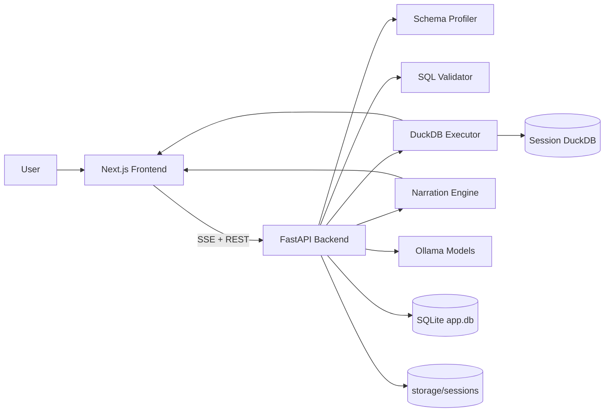

# Demo video drive link
https://drive.google.com/drive/folders/15uO9WEQdj_fa29jDpMfulLYhGImlXFqp

# NL Analytics Platform

A local, end-to-end natural language analytics platform that converts plain-English questions into SQL, executes safely on tabular data, and returns grounded answers with charts.

## Problem Statement
Analysts and business users often need quick answers from CSV data but lack SQL skills. Existing BI flows are either slow (manual query handoffs) or risky (unvalidated generated SQL and ungrounded narrative output).

This project solves that by providing a local, secure workflow:
1. Upload CSV datasets.
2. Ask questions in natural language.
3. Generate and validate SQL.
4. Execute against DuckDB.
5. Return table, chart, and grounded explanation.

## Solution Overview
The system uses a FastAPI backend and Next.js frontend, with Ollama-hosted local models for SQL generation and narration. It focuses on correctness, safety, and usability:
1. Schema profiling and relationship inference for better SQL context.
2. SQL guardrails (SELECT-only, allowlist, row and timeout limits).
3. Deterministic fallback narration when model output is ungrounded.
4. Persistent session history for reproducibility.

## Architecture Diagram (Mermaid)


## Features List
1. Multi-file CSV upload and per-session persistence.
2. Natural language to SQL generation with prompt constraints.
3. Safe SQL validation before execution.
4. Streaming results and narration over SSE.
5. Automatic chart recommendation based on result shape.
6. Grounding checks to detect narrative hallucinations.
7. Deterministic narrative fallback for reliability.
8. Data quality warnings surfaced during analysis.

## Project Structure Documentation
```text
nl-analytics/
|-- backend/
|   |-- app/
|   |   |-- api/              # FastAPI routes (ask, upload, schema, sessions)
|   |   |-- core/             # execution, validation, profiling, narration
|   |   |-- llm/              # ollama client and prompt builders
|   |   |-- db.py             # SQLite access layer
|   |   `-- main.py           # app entrypoint
|   |-- requirements.txt
|   `-- .env.example
|-- frontend/
|   |-- app/                  # Next.js app router pages
|   |-- components/           # UI components
|   |-- lib/                  # API utilities/types
|   |-- package.json
|   `-- .env.local.example
|-- storage/                  # runtime data (gitignored)
|-- .env.example              # root quick-start env template
`-- README.md
```

## Technology Stack (with Justification)
1. FastAPI: lightweight, fast async API layer with clean typing and SSE support.
2. DuckDB: high-performance embedded analytics engine ideal for local CSV workloads.
3. SQLite: simple persistent metadata store for sessions and chat history.
4. Next.js 14 + TypeScript: productive UI with robust type safety.
5. Plotly: flexible chart rendering for varied result sets.
6. Ollama: local model serving for offline/privacy-first workflows.
7. sqlglot: SQL parsing and validation guardrails before execution.
8. pandas: dataframe handling and payload shaping for frontend consumption.

## Installation & Setup Instructions
### Prerequisites
1. Python 3.11 or newer.
2. Node.js 20 or newer.
3. Ollama installed and running: https://ollama.com/download

### Model Setup
```powershell
ollama pull qwen2.5-coder:3b
ollama pull llama3.2:3b
```

### Backend Setup
```powershell
cd backend
python -m venv .venv
.\.venv\Scripts\Activate.ps1
pip install -r requirements.txt
copy .env.example .env
```

### Frontend Setup
```powershell
cd frontend
npm install
copy .env.local.example .env.local
```

### Run the System
Terminal 1:
```powershell
cd backend
.\.venv\Scripts\python.exe -m uvicorn app.main:app --reload --port 8000
```

Terminal 2:
```powershell
cd frontend
cmd /c npm run dev
```

Open the UI at http://localhost:3000 (or next available port shown by Next.js).

## How the System Works
1. User uploads CSV files into a session.
2. Backend stores raw files and loads them into session-scoped DuckDB.
3. Profiler inspects schema, datatypes, and likely relationships.
4. Prompt builder sends schema context and question to SQL model.
5. SQL validator enforces safety and structure constraints.
6. Executor runs validated SQL and returns dataframe payload.
7. Chart picker selects a suitable chart when applicable.
8. Narration model generates explanation text.
9. Grounding validator verifies numeric/entity consistency.
10. If ungrounded, deterministic narration replaces model text.

## Evaluation Strategy
### Accuracy
1. Compare generated SQL outputs against known benchmark queries.
2. Validate narration claims against result table values.
3. Track pass rate for top-N ranking and aggregation questions.

### Performance
1. Measure end-to-end latency by stage (SQL generation, execution, narration).
2. Benchmark large CSV ingestion and query response times.
3. Monitor row-limit and timeout behavior under load.

### Robustness Testing
1. Invalid or ambiguous NL prompts.
2. Missing columns and schema drift cases.
3. Data quality anomalies (nulls, outliers, malformed dates).
4. Prompt-injection style attempts in user input.

## Challenges & Trade-offs
1. Smaller local models are faster but less accurate on complex joins.
2. Strict validation improves safety but can reject borderline valid SQL.
3. Deterministic fallback boosts trust but may sound less conversational.
4. Session-scoped local storage is simple but requires disk hygiene.

## Future Improvements
1. Stronger semantic validation between question intent and SQL intent.
2. Multi-turn context memory with explicit correction loops.
3. Enhanced benchmarking dashboard for regression tracking.
4. Role-based access and authentication for multi-user deployment.
5. Support for additional connectors beyond CSV.

